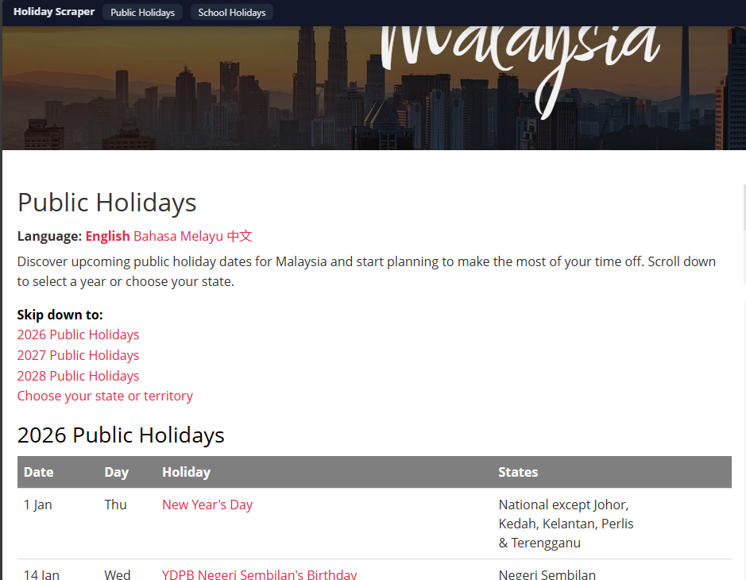

# Holiday Scraper Malaysia

A robust Tampermonkey userscript to scrape public and school holidays from [publicholidays.com.my](https://publicholidays.com.my/) and export them as CSV files.

## Features

- **Public Holidays Export**: Scrapes state-level and national public holidays.
- **School Holidays Export**: Supports School Groups (Kumpulan A & B) and other holidays.
- **Persistent UI**: A floating top bar that stays visible (fixed position) and auto-recovers if removed by the site.
- **Auto-run support**: Maintains state across page redirects for seamless scraping.

## Installation

1.  Install the **Tampermonkey** extension for your browser (Chrome, Edge, Firefox, etc.).
### Prerequisite: Enable File Access
**You must enable file access in your browser extension settings to use this script.**

1.  Go to your browser's **Extensions** management page (`chrome://extensions` or `edge://extensions`).
2.  Find **Tampermonkey** and click **Details**.
3.  Toggle **ON** the setting: **"Allow access to file URLs"**.

### Loading the Script
1.  Create a new script in Tampermonkey.
2.  Copy the contents of `holidayscraper.js` into it.
3.  Save the script.

## Usage

1.  Visit [publicholidays.com.my](https://publicholidays.com.my/).
2.  You will see a dark "Holiday Scraper" bar fixed at the top of the screen.
3.  Click **"Public Holidays"** to scrape and download the public holiday CSV.
4.  Click **"School Holidays"** to be redirected to the school holidays page (if not already there) and automatically start scraping.

## Author
aturcara
